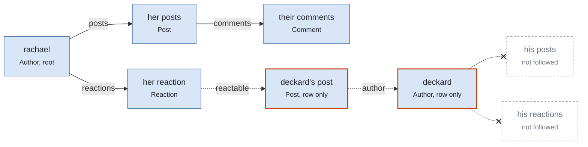

# How a dump traverses the graph

A dump starts at one record, the root, and follows its class's `replicate`
block: the plan. Two questions decide what ends up in the stream. Which edges
does deckard follow, and how much of a reached record's plan entry applies?

## Edges

Every association edge is one of two kinds:

| Edge | Meaning | Followed |
|---|---|---|
| `belongs_to` | this record depends on that one | always, so the foreign key resolves |
| `has_one`, `has_many` | this record owns that one | `has_one` for owned records; `has_many` only when the plan names it |

`has_many` is never followed on its own. It is the edge that can pull in a
large slice of the database, so a plan opts into each collection by name.

## Owned records and dependencies

How a record was reached decides how much of its plan entry applies:

| Record was reached | Carries | Does not carry |
|---|---|---|
| as the root | its `belongs_to` rows, its `has_one` rows, and the collections its entry names | |
| through ownership (`has_one` or a planned collection) | the same | |
| through reference (`belongs_to`) | its row and the rows it depends on | anything it owns, whatever its entry says |

A record reached only by reference is a dependency. It arrives so that the
record pointing at it loads, and it stops there. This is what keeps a dump the
size of the root's ownership tree rather than the connected component of the
database: without it, any `belongs_to` landing on a class whose entry names
collections would reopen those collections, and one order could become the
store.

## Worked example

A forum: authors own posts, posts own comments, authors own reactions, and a
reaction points at a post. Author's plan says an author carries posts and
reactions. Dump `rachael`, who reacted to one of deckard's posts.

Solid arrows are ownership edges, dashed arrows are `belongs_to`. The
reaction needs deckard's post row and the post needs deckard's row, so both
dashed hops happen. But deckard was reached by reference, so the Author entry
that says "carries posts and reactions" does not apply to him. His row lands,
his activity does not, and nothing beyond him is reached.

The stream for this dump holds three authors (rachael, deckard, and the
author of any comment on her posts), her posts and their comments, the one
post she reacted to, and her reaction.

## Several roots

Each record handed to `dump` is a root. `dump Author.where(username: %w[rachael
deckard])` gives both authors the full Author plan. If rachael's traversal
already wrote deckard as a dependency, his later turn as a root still walks his
collections; the identity set makes the second row write a no-op, so the
stream holds the union of both ownership trees, each record once.

The same holds inside one dump: a record reached first by reference and later
through ownership is written on the first visit and walked on the second.

## Cycles

A record reached again while its own dump is in progress can only have been
reached through its dependencies, which means they lead back to it. Deckard
raises `DumpError` naming both ends of the cycle rather than emitting a stream
the destination could not load in order.
